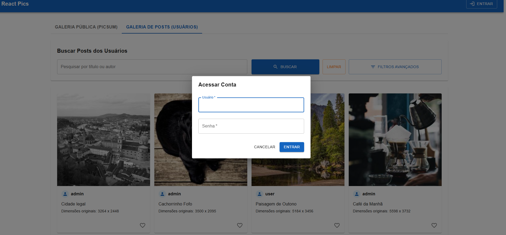
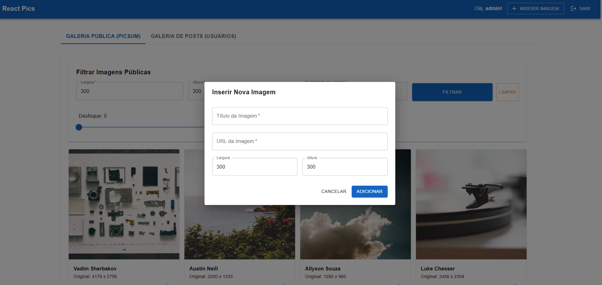
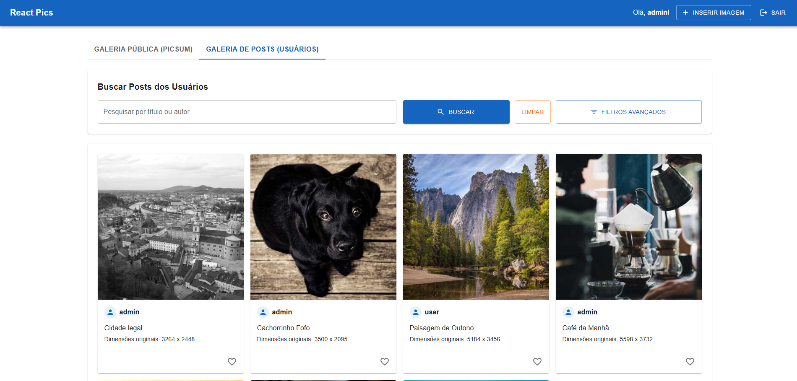

# React Pics

Este projeto é uma galeria de imagens interativa e segura de ponta a ponta (Fullstack), construída utilizando **React** no front-end, **Express** no back-end e **SQLite** como banco de dados.

Tecnologias utilizadas:
- React 19: https://react.dev/
- Vite: https://vite.dev/
- Express: https://expressjs.com/
- Material UI: https://mui.com/material-ui/
- **Picsum Photos API**: https://picsum.photos/

A aplicação foi projetada e estruturada para demonstrar a mitigação prática de vulnerabilidades críticas listadas no **OWASP Top 10**.

### Bibliotecas de segurança
- cors: https://www.npmjs.com/package/cors
- csrf: https://www.npmjs.com/package/csrf
- perfect-express-sanitizer: https://www.npmjs.com/package/perfect-express-sanitizer
- xss: https://www.npmjs.com/package/xss
- express-rate-limit: https://www.npmjs.com/package/express-rate-limit
- express-winston: https://www.npmjs.com/package/express-winston
- morgan: https://www.npmjs.com/package/morgan

## Screenshots
| Login | Galeria Pública |
|---|---|
|  |  |

| Inserir Imagem do usuário | Galeria Privada + Busca por título e autor |
|---|---|
|  |  |

---

## Estrutura do Projeto

```text
/
├── backend/
│   ├── src/
│   │   ├── config/       # Configuração do banco SQLite, Pool e Cache Manual
│   │   ├── models/       # Classes e queries parametrizadas (Prepared Statements)
│   │   └── routes/       # Rotas da API + Controladores integrados (Auth e Imagens)
│   ├── server.js         # Ponto de entrada do servidor Express
│   └── package.json
│
├── frontend/
│   ├── src/              # Aplicação React SPA
│   └── package.json
│
└── README.md             # Este arquivo de documentação
```

---

## Medidas de Segurança Implementadas (OWASP Top 10)

1. **Prevenção de SQL Injection (A03:2021-Injection)**:
   - Todas as consultas ao banco SQLite utilizam **Prepared Statements** com parâmetros vinculados (`?`).
   - Higienização global de inputs HTTP feita através do middleware `perfect-express-sanitizer`.

2. **Prevenção de Cross-Site Scripting (XSS)**:
   - Uso da biblioteca `xss` para limpar saídas e entradas de dados em formato de string antes do armazenamento ou exibição.

3. **Proteção contra Cross-Site Request Forgery (CSRF)**:
   - Validação robusta de tokens anti-CSRF gerados com a biblioteca `csrf` associados à sessão e validados em chamadas que modificam o estado (POST) via cabeçalho `X-CSRF-Token`.

4. **Mitigação de Brute Force e DDoS**:
   - Aplicação de `express-rate-limit` restrita a `POST /api/auth/login` (máximo de 5 tentativas por IP em um intervalo de 15 minutos).

5. **Gerenciamento de Sessão Seguro**:
   - Tokens de sessão efêmeros e únicos gerados criptograficamente.
   - Cache em memória manual com TTL (`SimpleCache`) para guardar sessões ativas com expiração automática, eliminando a dependência do `node-cache`.

6. **Registro e Auditoria**:
   - Logs de segurança emitidos pelo `winston` registrando tentativas malsucedidas de login, pesquisas realizadas e inserção de novos conteúdos.

---

## Configuração e Instalação

### Pré-requisitos
- Node.js (v18 ou superior)
- npm (v9 ou superior)

### Passo 1: Configurar Variáveis de Ambiente

#### Back-end
No diretório `/backend`, crie um arquivo `.env` copiando o modelo de `.env.example` e ajuste as chaves conforme necessário:
```bash
cd backend
cp .env.example .env
```
Exemplo de configuração do back-end (`.env.example`):
```env
PORT=3001
FRONTEND_URL=http://localhost:5173
USE_HTTPS=false
```

#### Front-end
No diretório `/frontend`, crie um arquivo `.env` copiando o modelo de `.env.example` (necessário caso a porta do back-end seja modificada):
```bash
cd ../frontend
cp .env.example .env
```
Exemplo de configuração do front-end (`.env.example`):
```env
VITE_API_URL=http://localhost:3001
```

---

## Como Rodar o Projeto

Você precisará iniciar o Back-end e o Front-end em dois terminais diferentes.

### Terminal 1: Servidor Back-end (Express + SQLite)
```bash
cd backend
npm install
npm start
```
*O banco de dados SQLite será criado e semeado automaticamente na primeira inicialização.*

### Terminal 2: Servidor Front-end (React SPA)
```bash
cd frontend
npm install
npm run dev
```

Abra [http://localhost:5173](http://localhost:5173) no seu navegador para utilizar o sistema.

---

## Usuários para Teste (Semeados Automaticamente)

| Nome de Usuário | Senha | Nível |
| :--- | :--- | :--- |
| `admin` | `admin123` | Administrador |
| `user` | `user123` | Usuário Padrão |
